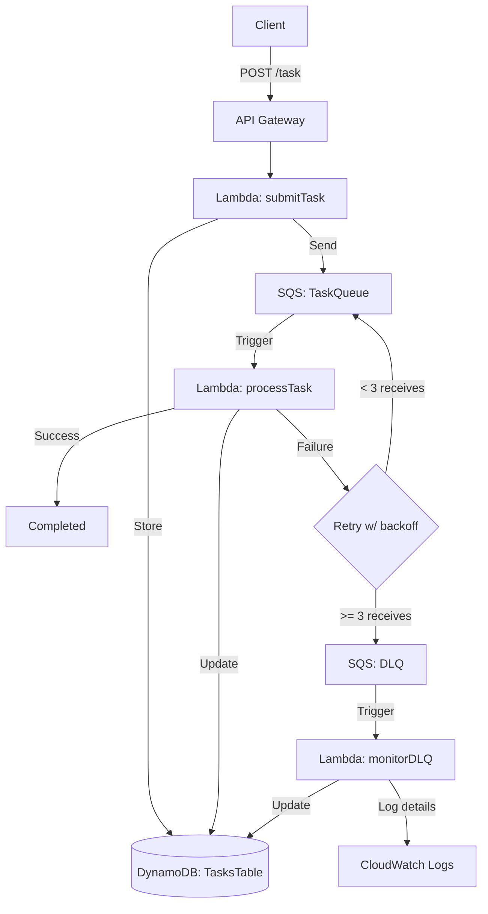

# TaskGuard: Fault‑Tolerant Task Processing System

  

A fault‑tolerant, event‑driven backend on AWS that processes tasks asynchronously and handles failures with retries and a DLQ. Built with API Gateway, Lambda, SQS, DynamoDB, and CloudWatch. Infrastructure is managed with the Serverless Framework.

  

## Overview

  

- Submit tasks via REST API (API Gateway → Lambda)

- Persist state in DynamoDB

- Process asynchronously via SQS (Lambda consumer)

- Simulate failures (30%) and use exponential backoff (5s → 10s → 20s)

- After 3 total receives, messages are routed to a DLQ

- DLQ is monitored by a Lambda that logs detailed information to CloudWatch

  

## Architecture

  



  

## Prerequisites

  

- Node.js 18+

- AWS CLI configured (`aws configure`)

- Serverless Framework CLI: `npm i -g serverless`

  

## Setup & Deployment

  

```bash

npm  install

npx  serverless  deploy

npx  serverless  info

```

  

Create `.env` (used by helper scripts):

  

```bash

cp  env.example  .env

Fill in values from `serverless info` or AWS Console

TASKS_QUEUE_URL=...
DLQ_URL=...
API_ID=...
AWS_REGION=...

```

  

## Testing

  

### Quick manual test

  

```bash

curl  -X  POST  https://<API_ID>.execute-api.eu-central-1.amazonaws.com/dev/task  \

-H "Content-Type: application/json" \

-d  '{"payload": {"name": "Test Task", "data": 1}}'

```

  

### End‑to‑end script (submits 30 tasks and reports outcomes)

  

```bash

chmod  +x  check_pipeline.sh

./check_pipeline.sh

```

  

The script prints:

- Queue progress (visible + in‑flight/delayed)

- A per‑task status sample (from DynamoDB) for this run

- FINAL lines (for the assignment):

-  `SUCCESS: <number>` – tasks that succeeded on the first attempt

-  `FAILURE: <number>` – tasks that failed on the first attempt (needed retry)

  

This demonstrates the 30% simulated failure rate on initial attempts, while retries drive most tasks to success.

  

## Failure simulation & retries

  

- Failure simulation (30%) occurs in `taskProcessor.js` via `simulateRandomFailure(0.3)`.

- Exponential backoff is applied using SQS `ChangeMessageVisibility` (5s, 10s, 20s) before the next receive.

- SQS redrives messages to the DLQ after `maxReceiveCount: 3` (configured in `serverless.yml`).

  

## Monitoring & Observability

  

CloudWatch Log Groups:

-  `/aws/lambda/TaskGuard-dev-submitTask`

-  `/aws/lambda/TaskGuard-dev-processTask`

-  `/aws/lambda/TaskGuard-dev-monitorDLQ`

  

DLQ logging (taskId, payload, lastError) is done in `dlqMonitor.js`:

```12:50:dlqMonitor.js

// Log comprehensive task failure details to CloudWatch

const logData = {

event: 'TASK_DEAD_LETTER',

taskId,

payload,

attempts: task?.attempts || 'unknown',

lastError: task?.lastError || 'No error details available',

createdAt: task?.createdAt || 'unknown',

failedAt: new Date().toISOString(),

};

console.log(JSON.stringify(logData, null, 2));

```

  

Useful CLI:

```bash

aws  logs  tail  /aws/lambda/TaskGuard-dev-processTask  --follow

aws  logs  filter-log-events  --log-group-name  /aws/lambda/TaskGuard-dev-monitorDLQ  --filter-pattern  "TASK_DEAD_LETTER"

aws  dynamodb  scan  --table-name  TasksTable  --limit  5

```

  

## Cleanup

  

```bash

npx  serverless  remove

```

  

## Files of interest

  

-  `serverless.yml` – infrastructure (queues, DLQ, table, functions, IAM)

-  `handler.js` – API handler (validates input, writes to DynamoDB, enqueues SQS)

-  `taskProcessor.js` – SQS consumer (simulates failures, backoff, updates status)

-  `dlqMonitor.js` – DLQ consumer (logs details to CloudWatch, updates status)

-  `check_pipeline.sh` – test runner that submits 30 tasks and reports outcomes